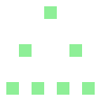

#  PyramidContainer

A container that arranges its child controls in the shape of a pyramid. That is, the <_biggest included power of two_> nodes will form the base layer, with the amount of nodes on each subsequent layer being _halfed_, until all nodes have been assigned:

While there might be further applications, this container was primarily developed to draw **tournament brackets**. That's why it includes code to automatically draw lines that connect two nodes in one layer to one node in the following layer:

 where the connection lines were automaticly added")

# Demo

The demo shown in the GIF above is included in this repo [here](https://github.com/njamster/pyramid_container/tree/main/examples).

# Documentation

Once the plugin has been enabled in the Project Settings, its documentation can be accessed directly from Godot: press ``F1``, then search for "PyramidContainer".
